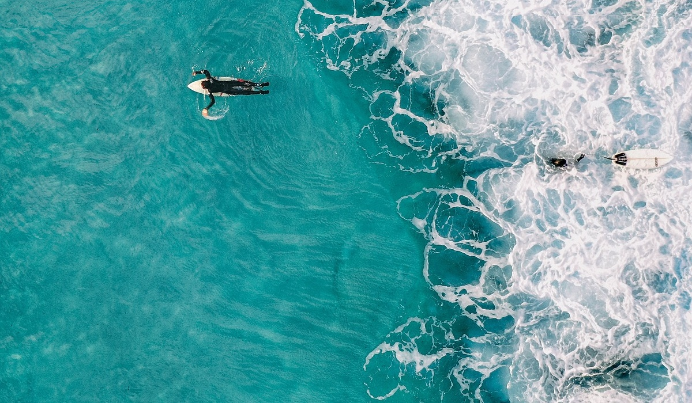
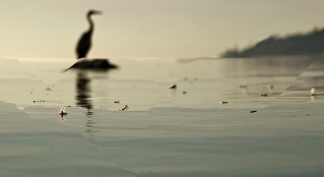

# Seam Carving Image Resizer

This project implements the **Seam Carving** algorithm to resize images content-aware. The algorithm reduces the dimensions of an image by removing seams with the least energy, preserving important image content as much as possible.

## Features

- Resizes images by reducing width and/or height.
- Displays the seams selected for removal, highlighted in red, before removing them.
- Supports both vertical and horizontal seam carving.
- Works without relying on external libraries for seam carving computation.

## Requirements

- OpenCV 4.x (for image processing and display)

## Installation

1. Install OpenCV on your system.

    ### On Ubuntu:
    ```bash
    sudo apt-get update
    sudo apt-get install libopencv-dev
    sudo apt-get install g++
    ```

    ### On Mac (using Homebrew):
    ```bash
    brew install opencv
    ```

2. Clone this repository:
    ```bash
    git clone <repository_url>
    cd seam-carving
    ```

3. Compile the code:

    ```bash
    g++ -o seam_carving seam_carving.cpp `pkg-config --cflags --libs opencv4`
    ```

## Usage

To run the seam carving algorithm, use the following command:

```bash
./seam_carving <input_image> <target_width> <target_height>
```

## Project Structure

```graphql
seam-carving/
│
├── seam_carving.cpp   # Main implementation of the seam carving algorithm
├── README.md          # Project documentation
└── CMakeLists.txt     # Optional: CMake build configuration
```


## Sample Snapshots

### Input Image

Here's the input image before seam carving:


### Carved Image

After applying seam carving, the resized image looks like this:




### Input Image


### Carved Image

